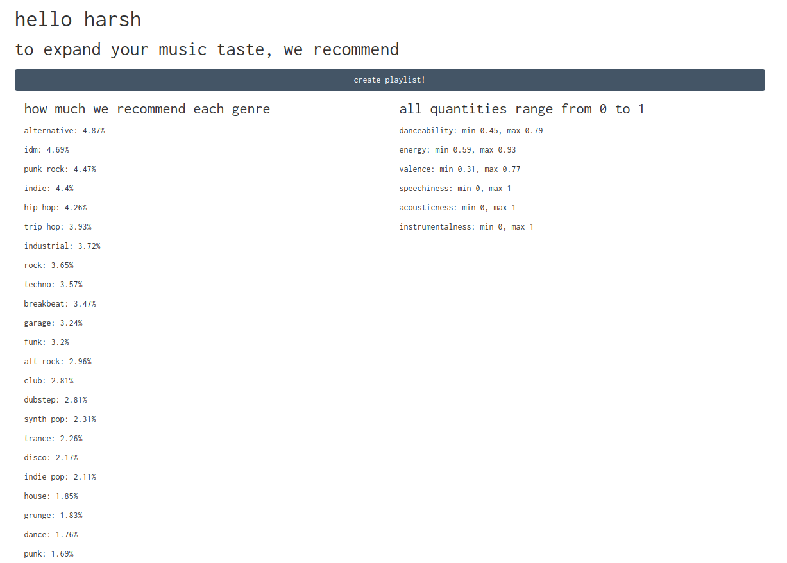
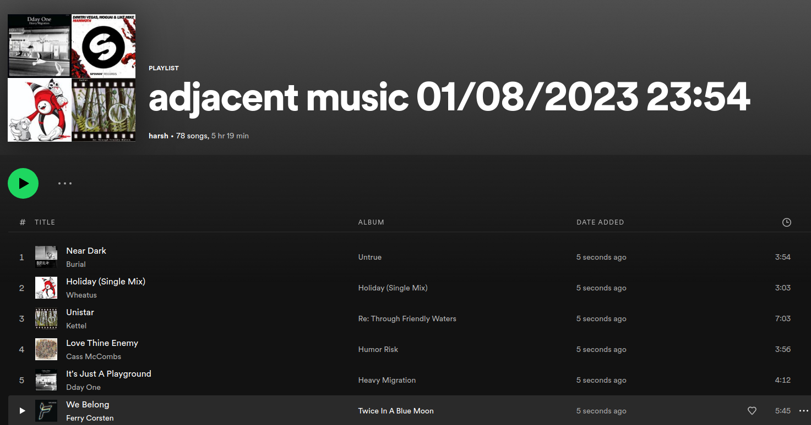

# Adjacent Music
This project was primarily motivated out of a desire to have a service that could
* analyze which genres a user listened to
* break down genres adjacent to those genres to expand the user's music taste (e.g. someone into jazz and funk could be recommended Afrobeat music)
* recommend tracks in those adjacent genres that still had similar audio features as the tracks that made up the user's listening history (e.g. high danceability, low valence, etc.).
</ul>
It is still in development mode, and needs to be approved by Spotify before it can be logged into by the general public, but will hopefully be exapanded in the future to be able to have more precise recommendations and easier playlisting. As it stands, the project uses a user's top 50 artists to create a list of genres to recommend (in Spotify, genres are associated with artists), and a user's top 50 tracks to create a range of audio features. These genres and audio features are then used with the /recommendations endpoint of Spotify's API to generate the recommendations created in every playlist.

## Privacy
* This project does not store usernames, passwords, or tokens on any server or database. All authentication and authorization is done through the [PKCE extension](https://oauth.net/2/pkce/) of Spotify's [OAuth](https://developer.spotify.com/documentation/general/guides/authorization/) authorization framework.
* Cookies are stored on this website simply for user convenience in logging in. They do not store any information regarding your listening data.

## Example
Upon logging in, a user may see a screen like this: 
The user can click the button to create a playlist, and will find a Spotify playlist created using these genres and features:  
